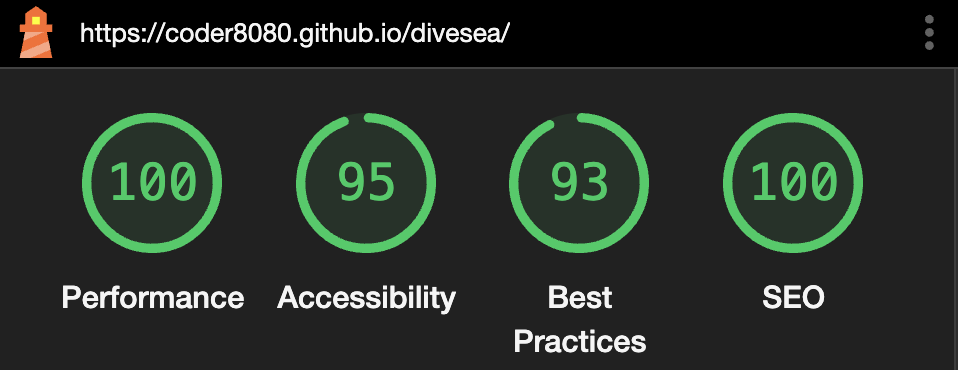

<a id="readme-top"></a>

[](https://www.solidjs.com)
[](https://tailwindcss.com)
[](https://pnpm.io)
[](https://coder8080.github.io/divesea)
[](https://github.com/coder8080/divesea/actions)

<div align="center">
  <picture>
    <source media="(prefers-color-scheme: dark)" srcset="public/icons/wave_white.svg">
    
  </picture>

  <h3 align="center">DiveSea</h3>

  <p align="center">
    Site for NFT tranding company
    <br />
    <a href="https://coder8080.github.io/divesea/">View on Github Pages</a>
  </p>
</div>


## About The Project

[](https://coder8080.github.io/divesea/)
[](https://coder8080.github.io/divesea/)

Built from [figma template](https://www.figma.com/design/VcgXyogEdaIAhaVBPlf5nC/DiveSea?node-id=5-17704&t=bRVSPqYxwYWM81oc-0) with minor improvements. Performant, accessible, adaptive, SEO-optimized.

<p align="right">(<a href="#readme-top">back to top</a>)</p>


## Getting Started

To get a local copy up and running follow these simple example steps.

### Prerequisites

* node >= 22
* pnpm
  ```sh
  npm install pnpm -g
  ```


### Development mode

1. Clone the repo
   ```sh
   git clone https://github.com/coder8080/divesea.git
   ```
2. Install packages
   ```sh
   pnpm install
   ```
3. Run project in development mode
  ```sh
  pnpm run dev
  ```

<p align="right">(<a href="#readme-top">back to top</a>)</p>


## Production mode

Docker is set up for production. Site will be available on [http://localhost:5000/divesea](http://localhost:5000/divesea)

1. Install [Docker](https://www.docker.com)
   ```sh
   bash <(curl -fsSL get.docker.com)
   ```
2. Run project
   ```sh
   docker compose up --build
   ```

<p align="right">(<a href="#readme-top">back to top</a>)</p>


## License

Distributed under the GPL-3.0 License. See [LICENSE](LICENSE) for more information.

<p align="right">(<a href="#readme-top">back to top</a>)</p>


## Contact

Roman Kolerov - [@coder8080](https://t.me/coder8080) - coder8080@yandex.ru

Project Link: [https://github.com/coder8080/divesea](https://github.com/coder8080/divesea)

<p align="right">(<a href="#readme-top">back to top</a>)</p>


## Acknowledgments

* [Figma Template](https://www.figma.com/design/VcgXyogEdaIAhaVBPlf5nC/DiveSea?node-id=5-1960&p=f&t=rLgyD0mHxQi70U5X-0)
* [Useful templates list](https://verstaem.online)

<p align="right">(<a href="#readme-top">back to top</a>)</p>
